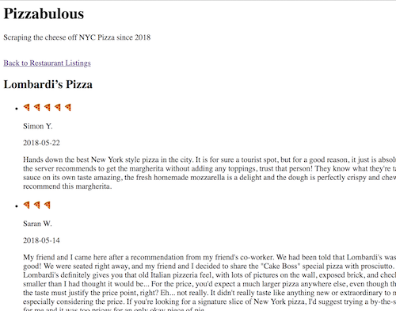

# Pizzabulous

A primitive version of a pizza review aggregator.


## Setup

### Using Docker

```bash
docker run -d -p 5000:5000 standyro/pizzabulous:latest
curl http://localhost:5000
curl http://localhost:5000?reviews=5
curl http://localhost:5000/api
```

### Mac OS X

- Python 3.6 (Using virtualenv)
```bash
virtualenv .
source ./bin/activate
pip install -r requirements.txt
python3 pizzabulous.py
```

## Testing

```bash
docker run standyro/pizzabulous:latest python3 test_pizzabulous.py
```

## Deployment

```bash
pip3 install zappa
zappa deploy
```

## Code Considerations

- Optimized for speed of development (<2 hr timebox) and laid out requirements (Flask, BeautifulSoup)
- Available via HTML and JSON
- Only some basic unit tests, no acceptance or integration tests
- Yelp API calls not cached, so slow performance as reviews results increase, would use a shared cache in production
- Rounded review integers up
- Deployed using Zappa to AWS Lambda

## Requirements

- Build a web page that accepts the name of a pizza restaurant in New York and displays the n most recent Yelp reviews for this restaurant, where n is a user input (assume n < 10).
- The web page should also display the average score (0-5) of the relevant reviews
- Python
- Use any Python packages/frameworks
- Yelp’s API does not support retrieving reviews, so you will have to scrape the data yourself.
